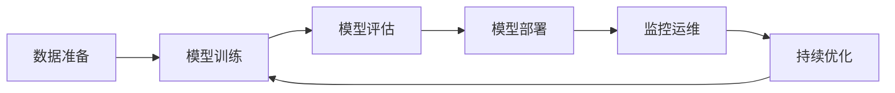

# 🚀 欢迎来到 AI Coder Hub！

> **Built with AI, for AI enthusiasts.**

这里是 **AI Coder Hub**，一个聚焦 AIGC 应用、大模型工程化与技术洞察的全栈开发者博客。

<!-- more -->

## 🎯 博客定位

作为一名 AI 全栈开发者，我将在这里持续分享：

| 方向 | 内容 | 目标读者 |
|------|------|----------|
| 🔮 AIGC 应用 | RAG、Agent、多模态应用实战 | AI 工程师、产品经理 |
| 🧠 大模型工程化 | 训练、微调、部署、推理优化 | 算法工程师、架构师 |
| 💡 技术洞察 | 行业趋势、技术选型、最佳实践 | 技术决策者 |
| ⚡ 全栈开发 | 从 Prompt 到 Production | 全栈开发者 |

## 🔬 核心技术栈

### 大语言模型 (LLM)

探索 GPT、Claude、LLaMA 等大模型的原理与应用：

```python
from openai import OpenAI

client = OpenAI()
response = client.chat.completions.create(
    model="gpt-4o",
    messages=[
        {"role": "system", "content": "你是一位 AI 架构师"},
        {"role": "user", "content": "设计一个 RAG 系统的架构"}
    ],
    temperature=0.7,
)
print(response.choices[0].message.content)
```

### 深度学习

从 Transformer 到 Diffusion Model，深入理解核心架构：

$$
\text{Attention}(Q, K, V) = \text{softmax}\left(\frac{QK^T}{\sqrt{d_k}}\right)V
$$

### AI 工程化

从实验室到生产环境的完整链路：



## 🗺️ 内容路线图

- [x] 博客搭建与主题定制
- [ ] RAG 系统从零到一实战
- [ ] LLM Agent 开发框架对比
- [ ] 大模型微调最佳实践
- [ ] AI 应用性能优化指南
- [ ] Prompt Engineering 系统教程

---


🌟 **关注我**，一起在 AI 浪潮中乘风破浪！


> *Stay hungry, stay foolish.* 🤖
